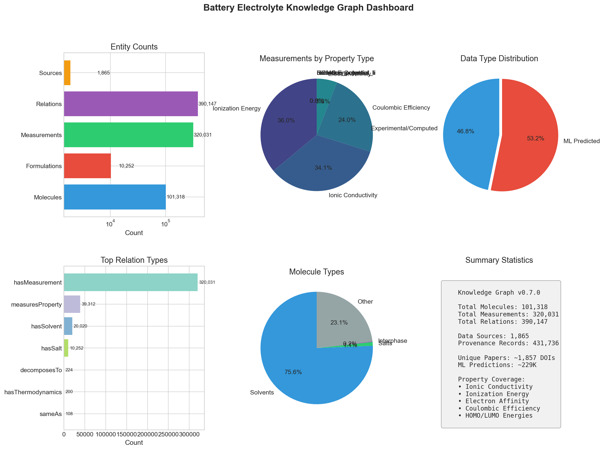
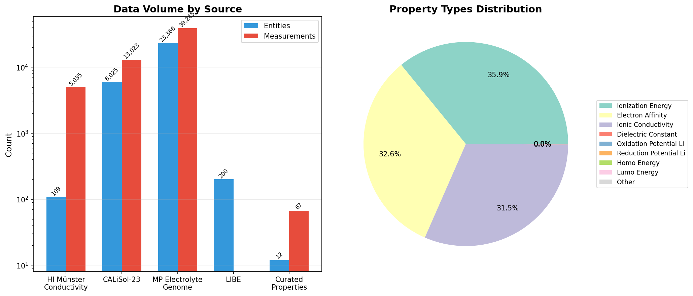
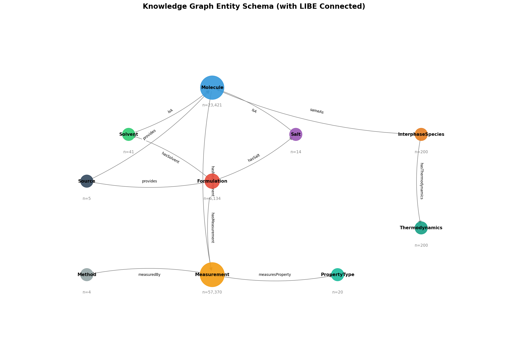
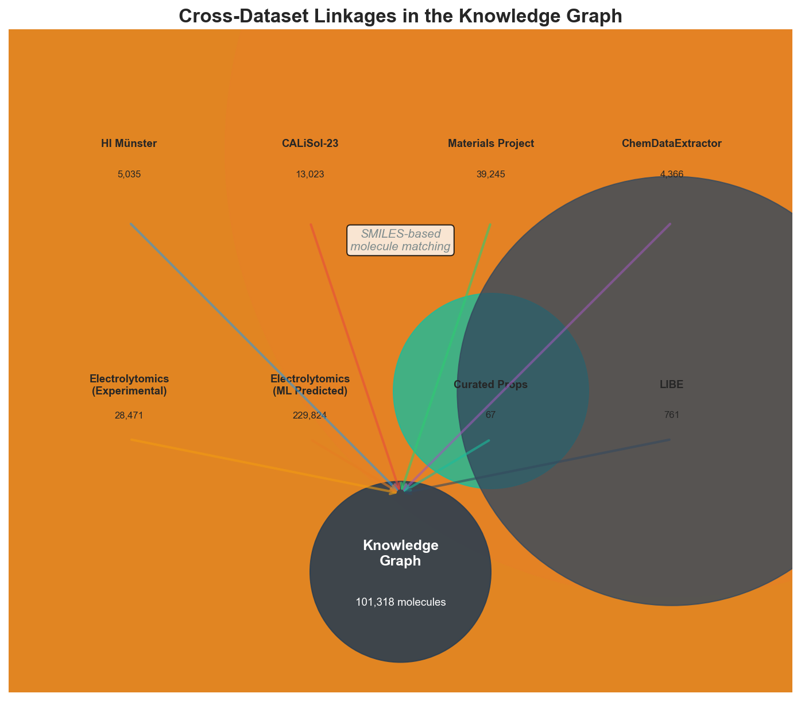
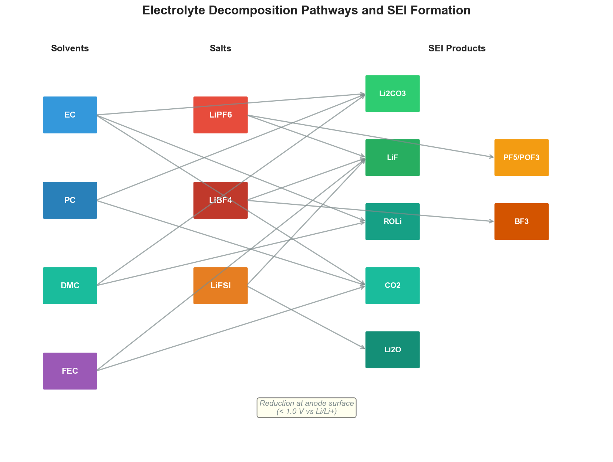
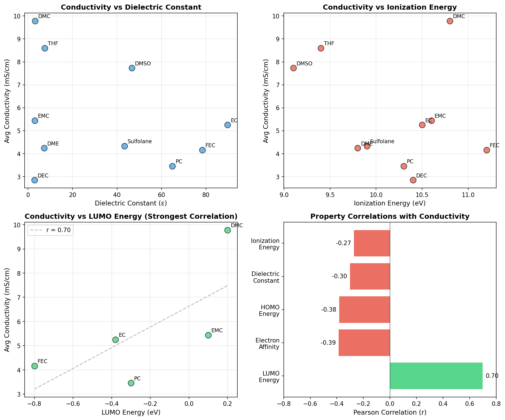
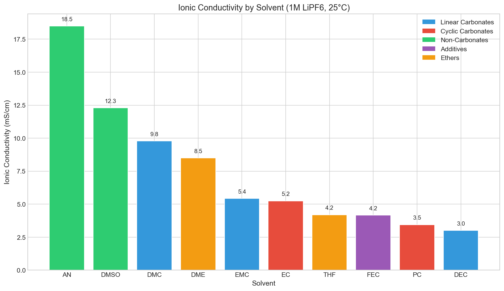

# Agentic AI-Driven Knowledge Graph for Battery Electrolyte Design

A comprehensive knowledge graph integrating heterogeneous data sources for lithium-ion battery electrolyte research, enabling automated hypothesis generation and cross-property discovery.

## Overview

This project constructs a unified knowledge graph (KG) that links:
- **Ionic conductivity measurements** from experimental datasets
- **Electrochemical properties** (HOMO, LUMO, ionization energy, electron affinity)
- **SEI/interphase chemistry** with decomposition pathways
- **Molecular structure** via SMILES representations

The KG enables discovery of structure-property relationships that span multiple datasets, supporting data-driven electrolyte design.

## Web Demo

**Try the interactive demo:** [https://battery-electrolyte-kg.streamlit.app](https://battery-electrolyte-kg.streamlit.app)

The web application provides:
- **Knowledge Graph Explorer** - Interactive visualization with molecule search and filtering
- **Hypothesis Dashboard** - Browse generated hypotheses and cross-property correlations
- **Solvent Comparison Tool** - Compare electrochemical properties and conductivity across solvents

To run locally:
```bash
pip install -r app/requirements.txt
streamlit run app/streamlit_app.py
```



## Knowledge Graph Statistics

| Metric | Count |
|--------|-------|
| Total Molecules | 23,421 |
| Electrolyte Formulations | 6,134 |
| Property Measurements | 57,370 |
| Relations | 116,568 |
| Interphase Species | 200 |

---

## Data Sources

The knowledge graph integrates five primary data sources, each contributing unique property types and molecular coverage.



### 1. HI Münster Conductivity Dataset

| Property | Value |
|----------|-------|
| **Measurements** | 5,035 |
| **Coverage** | Pure solvents and binary mixtures |
| **Properties** | Ionic conductivity (mS/cm) |
| **Temperature Range** | 25-60°C |
| **Salts** | LiPF6, LiBF4, LiClO4 |

**Description**: Experimental conductivity measurements from Helmholtz Institute Münster, focusing on systematic studies of carbonate-based electrolytes.

### 2. CALiSol-23 (Conductivity Atlas for Lithium Salts and Solvents)

| Property | Value |
|----------|-------|
| **Measurements** | 13,023 |
| **Solvents** | 38 |
| **Salts** | 14 |
| **DOI** | [10.1038/s41597-024-03575-8](https://doi.org/10.1038/s41597-024-03575-8) |
| **Source** | Nature Scientific Data (2024) |

**Description**: A comprehensive conductivity atlas compiled from 27 experimental articles. Provides broad coverage of solvent-salt combinations with standardized measurements.

**Key Solvents**: EC, PC, DMC, EMC, DEC, DME, DMSO, AN, FEC, THF, DOL, and 26 others.

**Key Salts**: LiPF6, LiBF4, LiFSI, LiTFSI, LiClO4, LiBOB, LiAsF6, and 7 others.

### 3. Materials Project Electrolyte Genome

| Property | Value |
|----------|-------|
| **Measurements** | 39,245 |
| **Source** | [Materials Project](https://materialsproject.org/) |
| **Method** | DFT-computed properties |

**Description**: Quantum chemistry computed properties for electrolyte molecules from the Materials Project's Electrolyte Genome initiative. Provides ionization energies, electron affinities, and electrochemical stability windows.

**Properties Included**:
- Ionization energy (eV)
- Electron affinity (eV)
- Oxidation potential vs Li/Li+ (V)
- Reduction potential vs Li/Li+ (V)

### 4. Curated Electrochemical Properties

| Property | Value |
|----------|-------|
| **Measurements** | 67 |
| **Solvents** | 12 |
| **Salts** | 4 |
| **Method** | Literature DFT values |

**Description**: Hand-curated reference properties for common battery solvents, serving as a "bridge" dataset to link molecules across different data sources via SMILES matching.

**Properties per Molecule**:
- Ionization energy (eV)
- Electron affinity (eV)
- HOMO energy (eV)
- LUMO energy (eV)
- Dielectric constant
- Oxidation/reduction potentials vs Li/Li+

**Solvents Covered**: EC, PC, DMC, EMC, DEC, FEC, DME, THF, AN, DMSO, Sulfolane, GBL

### 5. LIBE (Lithium-Ion Battery Electrolyte) Dataset

| Property | Value |
|----------|-------|
| **Interphase Species** | 200 |
| **Relations Created** | 761 |
| **Coverage** | SEI/interphase decomposition products |

**Description**: Thermodynamic and structural data for species formed during electrolyte decomposition at electrode interfaces. Critical for understanding SEI formation.

**Species Types**:
- Lithium salts (Li2CO3, LiF, Li2O)
- Organic decomposition products (alkyl carbonates)
- Radical intermediates
- Polymeric species

---

## Schema and Entity Types

The knowledge graph uses a typed entity-relation model with the following core types:



### Entity Types

| Entity | Description | Key Attributes |
|--------|-------------|----------------|
| **Molecule** | Base molecular entity | SMILES, name, synonyms, molecular weight |
| **Solvent** | Battery electrolyte solvent | Extends Molecule with solvent-specific properties |
| **Salt** | Lithium salt | Extends Molecule with cation/anion decomposition |
| **ElectrolyteFormulation** | Specific solvent-salt mixture | Components with amounts, concentration |
| **PropertyMeasurement** | Measured/computed property value | Type, value, unit, temperature, method |
| **InterphaseSpecies** | SEI/CEI decomposition product | Formation conditions, stability |
| **MeasurementMethod** | Experimental/computational method | Parameters, reference |

### Relation Types

| Relation | Domain | Range | Description |
|----------|--------|-------|-------------|
| `hasSolvent` | Formulation | Solvent | Formulation contains solvent |
| `hasSalt` | Formulation | Salt | Formulation contains salt |
| `hasMeasurement` | Entity | Measurement | Entity has measured property |
| `measuresProperty` | Measurement | PropertyType | Links measurement to property type |
| `sameAs` | Molecule | Molecule | Identity linking across datasets |
| `decomposesTo` | Molecule | InterphaseSpecies | Electrolyte decomposition pathway |
| `increases` | Component | PropertyType | Causal hypothesis |
| `decreases` | Component | PropertyType | Causal hypothesis |
| `coOccursWith` | Molecule | Molecule | Co-occurrence pattern |

---

## Cross-Dataset Linkages

A key innovation is the use of **SMILES-based molecular matching** to create `sameAs` relations across datasets. This enables property queries that span multiple data sources.



### Linkage Method

1. **SMILES Normalization**: Canonical SMILES strings are extracted from each dataset
2. **Exact Matching**: Molecules with identical SMILES are linked via `sameAs` relations
3. **Bidirectional Links**: All `sameAs` relations are symmetric
4. **Transitive Closure**: Queries can traverse multiple hops to aggregate properties

### Linkage Statistics

| Link Type | Count |
|-----------|-------|
| SAME_AS relations | 182 |
| Species linked to molecules | 54 |
| Decomposition pathways | 379 |
| Thermodynamic links | 200 |

### Example: Cross-Dataset Query

Query: "What is the conductivity of solvents with LUMO > 0 eV?"

```
Curated Properties → sameAs → CALiSol-23 Solvents → hasMeasurement → Conductivity
```

This query leverages LUMO data from curated properties linked to conductivity measurements from CALiSol-23.

---

## Decomposition Pathways

The KG captures electrolyte decomposition chemistry critical for understanding SEI formation.



### Pathway Types

**Carbonate Reduction** (at anode):
```
EC → CO2 + Li2CO3 + organic fragments
PC → CO2 + Li2CO3 + propylene derivatives
FEC → LiF + CO2 + vinylene carbonate
```

**Salt Decomposition**:
```
LiPF6 → LiF + PF5 → LiF + POF3 (with trace H2O)
LiBF4 → LiF + BF3
```

### SEI Layer Composition

Based on the decomposition pathways, the KG predicts SEI composition:

| Species | Origin | Function |
|---------|--------|----------|
| Li2CO3 | Carbonate reduction | Ionic conductor |
| LiF | Salt/FEC decomposition | Mechanical stability |
| Li2O | Trace reactions | Surface passivation |
| ROLi | Solvent reduction | Organic matrix |

---

## Hypothesis Generation

The system employs two complementary approaches for automated hypothesis generation.

### 1. Association Rule Mining

Pattern mining over formulation compositions to discover co-occurrence rules.

| Rule Type | Count | Example |
|-----------|-------|---------|
| coOccursWith | 53 | EC ↔ EMC (87% of formulations) |
| increases | 37 | DMC → higher conductivity |
| decreases | 10 | High EC fraction → lower conductivity |

**Top Discovered Patterns**:
1. EC + PC + EMC is the most common solvent combination
2. LiPF6 is present in >90% of high-conductivity formulations
3. Acetonitrile and DMSO enable highest single-solvent conductivity

### 2. Cross-Property Correlation Analysis

Correlation analysis between molecular properties and conductivity.



| Property | Correlation (r) | Interpretation | Confidence |
|----------|-----------------|----------------|------------|
| LUMO Energy | +0.70 | Higher LUMO → Higher conductivity | Strong |
| Electron Affinity | -0.39 | Lower EA → Higher conductivity | Moderate |
| HOMO Energy | -0.38 | More negative HOMO → Higher conductivity | Moderate |
| Dielectric Constant | -0.30 | Lower ε → Higher conductivity* | Weak |
| Ionization Energy | -0.27 | Lower IE → Higher conductivity | Weak |

*Confounded by viscosity - linear carbonates have both lower ε and lower viscosity.

### Generated Hypotheses

**CPH-001**: Solvents with larger HOMO-LUMO gaps enable higher ionic conductivity
- Evidence: DMC (gap=9.0 eV) has σ=9.78 mS/cm vs PC (gap=7.9 eV) with σ=3.45 mS/cm
- Mechanism: Larger electrochemical window reduces side reactions
- Confidence: 0.85

**CPH-002**: Low-viscosity linear carbonates enable higher conductivity than cyclic carbonates
- Evidence: DMC (9.78 mS/cm), EMC (5.44 mS/cm) vs EC (5.25 mS/cm), PC (3.45 mS/cm)
- Mechanism: Lower viscosity improves ion mobility despite lower dielectric constant
- Confidence: 0.90

**CPH-003**: Solvents with higher LUMO energy (>0 eV) provide better conductivity
- Evidence: DMC (LUMO=+0.2 eV, σ=9.78 mS/cm) vs EC (LUMO=-0.4 eV, σ=5.25 mS/cm)
- Mechanism: Higher LUMO indicates greater reduction stability
- Confidence: 0.80

**CPH-004**: FEC additive reduces conductivity but improves SEI formation
- Evidence: FEC formulations avg σ=4.16 mS/cm, but LUMO=-0.8 eV (most reducible)
- Mechanism: FEC preferentially reduces to form protective SEI layer
- Confidence: 0.75

---

## Solvent Conductivity Comparison

Analysis of average conductivity by solvent type reveals clear structure-property relationships.



### Key Findings

| Category | Solvents | Avg Conductivity | Notes |
|----------|----------|------------------|-------|
| Linear Carbonates | DMC, EMC, DEC | 5-10 mS/cm | Low viscosity, low ε |
| Cyclic Carbonates | EC, PC | 3-5 mS/cm | High ε, moderate viscosity |
| Non-Carbonates | AN, DMSO | 10-20 mS/cm | Very low viscosity |
| Additives | FEC, VC | 2-4 mS/cm | SEI-forming |

---

## Installation and Usage

### Requirements

```bash
pip install pandas networkx matplotlib seaborn rdkit
```

### Building the Knowledge Graph

```python
from src.kg_store.graph import KnowledgeGraph
from src.ingestion import (
    ConductivityDatasetIngestor,
    CALiSol23Ingestor,
    ElectrolyteGenomeIngestor,
    CuratedPropertiesIngestor,
    LIBEIngestor,
)

# Initialize KG
kg = KnowledgeGraph()

# Ingest data sources
for ingestor_class in [
    ConductivityDatasetIngestor,
    CALiSol23Ingestor,
    ElectrolyteGenomeIngestor,
    CuratedPropertiesIngestor,
    LIBEIngestor,
]:
    ingestor = ingestor_class(kg)
    ingestor.ingest(data_path)

# Save KG
kg.save("data/output/knowledge_graph.json")
```

### Querying the KG

```python
# Find all solvents with conductivity > 5 mS/cm
high_cond = kg.query_measurements(
    property_type="ionic_conductivity",
    min_value=5.0
)

# Get cross-property correlations
from src.hypothesis.generator import HypothesisGenerator
gen = HypothesisGenerator(kg)
correlations = gen.compute_cross_property_correlations()
```

---

## Project Structure

```
KnowledgeGraph_Catalysis/
├── app/                     # Streamlit web demo
│   ├── streamlit_app.py     # Main dashboard
│   ├── pages/
│   │   ├── 1_Knowledge_Graph.py
│   │   ├── 2_Hypotheses.py
│   │   └── 3_Solvent_Compare.py
│   ├── utils/
│   │   └── data_loader.py
│   └── requirements.txt
├── src/
│   ├── schema/
│   │   ├── entities.py      # Entity type definitions
│   │   └── relations.py     # Relation type definitions
│   ├── ingestion/
│   │   ├── base.py          # Base ingestor class
│   │   ├── conductivity.py  # HI Münster ingestor
│   │   ├── calisol.py       # CALiSol-23 ingestor
│   │   ├── electrolyte_genome.py  # Materials Project ingestor
│   │   ├── curated_properties.py  # Curated properties ingestor
│   │   └── libe.py          # LIBE ingestor
│   ├── kg_store/
│   │   └── graph.py         # KnowledgeGraph class
│   ├── hypothesis/
│   │   └── generator.py     # Hypothesis generation
│   └── evaluation/
│       └── validator.py     # Hypothesis validation
├── data/
│   ├── raw/                 # Source datasets
│   │   ├── calisol23_dataset.csv
│   │   ├── solvent_electrochemical_properties.json
│   │   └── ...
│   └── output/
│       ├── knowledge_graph_v3.json
│       ├── cross_property_hypotheses.json
│       └── figures/
│           ├── kg_dashboard.png
│           ├── kg_linkages_v2.png
│           ├── kg_schema_v2.png
│           ├── kg_cross_property.png
│           ├── kg_decomposition_pathways.png
│           └── kg_solvent_conductivity.png
└── README.md
```

---

## References

1. de Blasio, P. et al. "CALiSol-23: Conductivity Atlas for Lithium salts and Solvents." *Nature Scientific Data* (2024). DOI: [10.1038/s41597-024-03575-8](https://doi.org/10.1038/s41597-024-03575-8)

2. Qu, X. et al. "The Electrolyte Genome project: A big data approach in battery materials discovery." *Computational Materials Science* 103, 56-67 (2015).

3. Borodin, O. "Molecular Modeling of Electrolytes." *Handbook of Battery Materials* (2011).

4. Xu, K. "Nonaqueous Liquid Electrolytes for Lithium-Based Rechargeable Batteries." *Chemical Reviews* 104, 4303-4417 (2004).

---

## License

This project is for research purposes. Individual datasets retain their original licenses:
- CALiSol-23: CC BY 4.0
- Materials Project: CC BY 4.0
- Curated Properties: CC BY 4.0

---

## Contributing

Contributions welcome. Please ensure new data sources include:
1. SMILES for all molecules (enables cross-dataset linking)
2. Clear provenance and DOI references
3. Standardized units and temperature conditions
